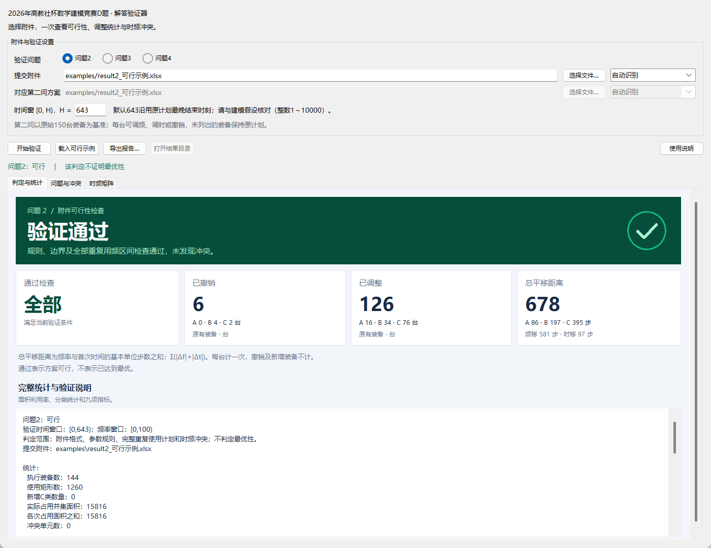
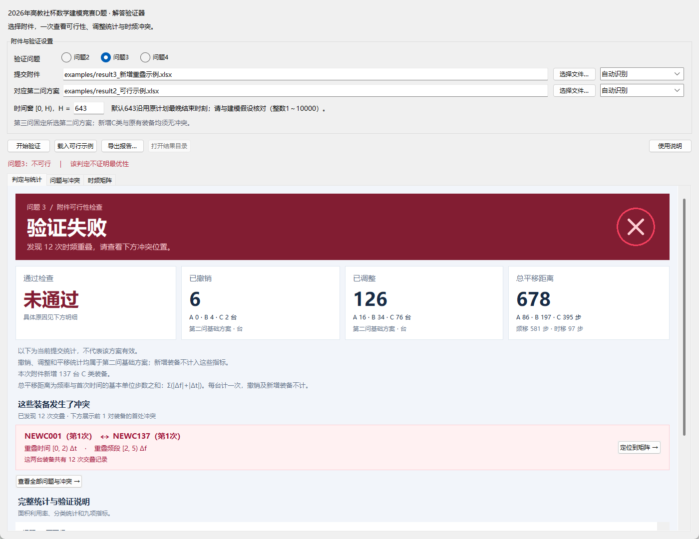
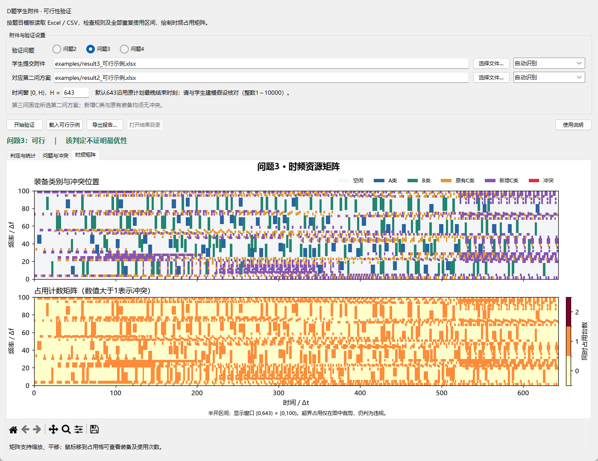

# 2026年高教社杯数学建模竞赛D题 · 解答验证器

本程序基于2026年高教社杯数学建模竞赛D题，用于检查第二、三、四问的 Excel 结果附件：有没有违反调整规则，后续重复使用是否越界，哪些装备发生了冲突。结果可以画成时频矩阵，也可以导出成图片和 Excel 明细。

这是一个离线桌面程序，文件在本机读取，不修改提交的原件，也不上传数据。**通过检查表示方案可行，不代表已经最优。**

## 下载

**[下载最新版](https://github.com/wwn7268/cumcm-2026-d-validator/releases/latest)**

下载 ZIP 后先完整解压。电脑需要 **Python 3.10 或以上**，以及 Tkinter、openpyxl、numpy、matplotlib。Windows 安装 Python 时请勾选添加到 PATH，并保留 Tkinter 图形组件。

第一次使用，在解压目录打开终端，安装依赖：

```powershell
python -m pip install -r requirements.txt
```

然后双击 **启动验证器.cmd**。也可以运行 `python app.py`。准备好环境后，无需联网。

## 先试一份示例

1. 打开程序，选择问题编号。
2. 点击 **载入可行示例**，再点 **开始验证**。
3. 先看“判定与统计”：绿色表示验证通过，红色表示验证失败；下方直接显示检查状态、已撤销数、已调整数和总平移距离。
4. 换成要检查的提交附件后，按同样的步骤验证；需要保存时点击 **导出报告**。

“已撤销”“已调整”“总平移距离”下面的小字分别列出 A、B、C 类的分项，便于对照总数。前两项以台计，平移距离以步计。



验证失败时，这一页会列出冲突双方的装备编号、各自第几次使用，以及相交的时间和频段。点击 **定位到矩阵** 就能查看冲突位置，全部记录在“问题与冲突”页。橙色的“验证未完成”表示文件还没有完整检查完，请先按提示处理输入问题。



| 要验证的题目 | 选择的文件 |
|---|---|
| 第二问 | 提交的 `result2.xlsx` |
| 第三问 | 提交的 `result3.xlsx`，以及与它配套的 `result2.xlsx` |
| 第四问 | 提交的 `result4.xlsx`，无需第二问附件 |

第三问按固定第二问布局检查，因此两份附件要属于同一套方案。第四问从原始 150 台装备重新开始，允许 C 类单独改间隔。

时间窗默认 **H=643**，取原计划最晚结束时刻；这是建模假设，请与论文核对，必要时在界面中修改。



矩阵中的红色表示冲突。双击冲突记录可以定位到对应区域，鼠标移到格子上可以查看占用装备。

总平移距离按未撤销装备的调频步数与调时步数相加，每台只计一次；第四问的间隔改变量另列。第三问的撤销、调整和平移统计来自配套的第二问方案。

**详细步骤、使用截图、附件格式和常见问题，请看 [使用说明](使用说明.md)。** 随程序提供的正确、错误附件见 [示例说明](examples/说明.md)。

## 数据来源

程序中的 150 台原始装备参数由题目附件1整理，演示附件由相应模型的求解结果生成。仓库不包含原题 PDF 或使用者提交的文件。
