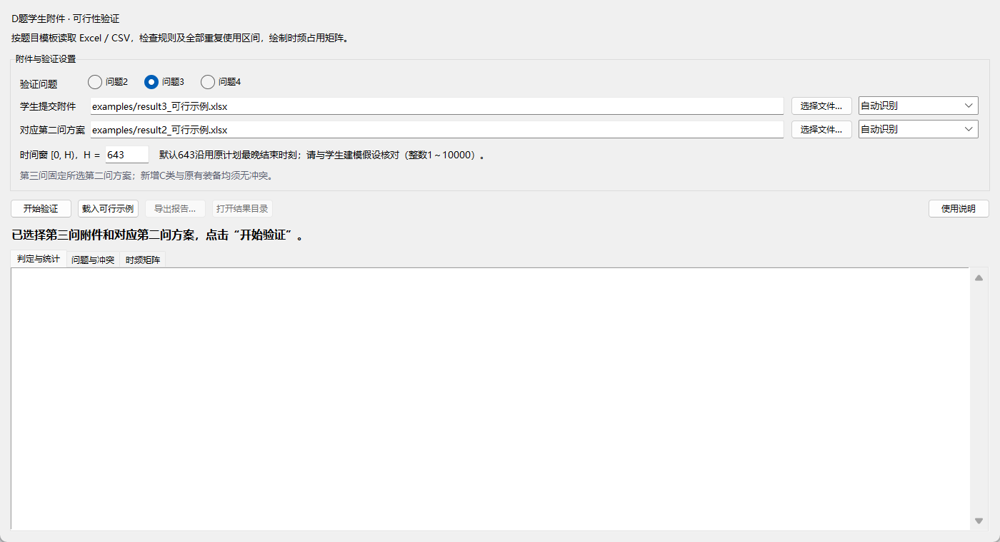
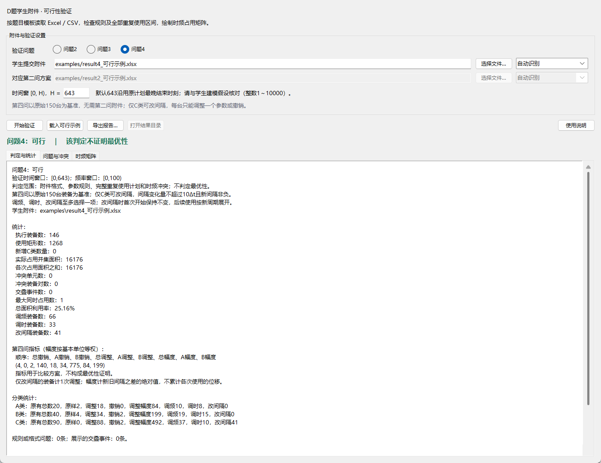
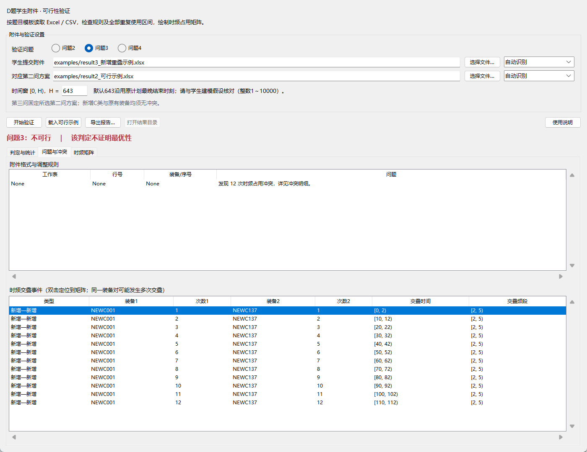

# 使用说明

这个小程序用来检查 D 题第二、三、四问的结果附件。选好 Excel，点击验证，就能看到哪里违反了调整规则、哪些装备发生冲突，以及完整的时频占用图。

文件只在本机读取，程序不会改动学生提交的原件。

## 下载后怎么打开

从 [下载页面](https://github.com/wwn7268/cumcm-d-validator/releases/latest) 取得程序 ZIP，**先完整解压，再运行**。

电脑需要 Python 3.10 或以上，并带有 Tkinter 图形组件。Windows 安装 Python 时，请勾选添加到 PATH；如果这台电脑已经能运行验证器，就不用重新准备环境。

第一次使用，在解压后的文件夹中打开终端，输入：

```powershell
python -m pip install -r requirements.txt
```

安装完成后，双击 **启动验证器.cmd**。以后直接双击它即可，验证和导出都可以离线完成。

也可以在程序目录运行：

```powershell
python app.py
```

## 先用示例试一遍

1. 选择“问题2”。
2. 点击 **载入可行示例**。
3. 点击 **开始验证**。

“判定与统计”里应显示“可行”。再切换到“时频矩阵”，就能看到这一方案的占用情况。

问题3、问题4也可以这样试。选择问题3后载入示例，程序会一并填好与它配套的第二问附件。示例文件放在 `examples` 文件夹里，其中也有故意出错的附件，适合用来演示如何查错，说明见 [示例说明](examples/说明.md)。

## 换成学生的附件

### 第二问：选 result2.xlsx

选择“问题2”，在“学生提交附件”一栏选择学生的 `result2.xlsx`，然后点击 **开始验证**。

第二问只需填写调整或撤销的装备。没有出现在表里的装备，程序会保留其原始计划。每台装备只能调频、调时或撤销，至多选一种；调频幅度不超过 10Δf，调时幅度不超过 5Δt。

### 第三问：同时选好对应的第二问附件

选择“问题3”，上面选择 `result3.xlsx`，下面“对应第二问方案”选择**同一学生、同一套方案的 `result2.xlsx`**。



程序先检查第二问方案，再把第三问的新增 C 类装备放进去检查。换了第二问的布局，第三问是否冲突也可能改变，所以这两个文件必须配套。

这里按“第二问的位置已经固定，再加入新装备”的方式验证。如果学生在第三问又重新调整了原有装备，需要先核对论文采用的模型。

### 第四问：直接选 result4.xlsx

选择“问题4”，打开学生的 `result4.xlsx`，点击 **开始验证**，不用选择第二问附件。

第四问从原始 150 台装备重新开始，不包含第三问新增的装备。除了调频、调时和撤销，C 类还可以改间隔；每台装备仍然只能调整一个参数，或者撤销。

C 类的新间隔可以取整数 **0～18**，A、B 类的间隔不能改。表中“调整后间隔时长”要填**改完后的值**：原来是 8，改成 7，就填 7；改成 0，就填数字 0。

下图是随程序提供的第四问示例：撤销 4 台、调整 140 台，其中 41 台改了间隔。



### 验证前，核对一下时间窗

界面里的 `H` 默认是 **643**，取自原计划最晚结束时刻。题目没有明确规定这个截止时间，因此要与学生论文的假设对照；采用其他时间窗时，可以改成相应的整数，范围为 1～10000。

程序会检查每一次重复使用是否都落在时间 `[0,H)`、频率 `[0,100)` 内。只看首次使用时间，可能漏掉后续越界。

## 结果怎么看

### “判定与统计”：先看结论，再看数量

- **可行**：通过了当前设置下的规则、边界和冲突检查。
- **不可行**：存在违反约束的地方，去“问题与冲突”查看具体位置。
- **输入错误或校验未完成**：文件没有完整读入，或必要的数据有问题，先按提示修正附件。

“可行”不等于“最优”。程序会列出撤销数、调整数、调整幅度或新增数量，便于比较方案，但不会据此证明已经达到最优值。

第二、四问的九项指标依次为：总撤销、A 撤销、B 撤销、总调整、A 调整、B 调整、总幅度、A 幅度、B 幅度。幅度以基本单位相加；第四问改间隔的幅度是新旧间隔之差的绝对值，不累加后续各次使用的位移。

### “问题与冲突”：找到要改的地方

这里会列出错误所在的工作表、行号、装备编号，以及发生冲突的时间和频段。

**双击一条冲突记录，可以定位到矩阵对应区域。** 同一对装备可能在不同使用次数上发生多次冲突，因此表中可能出现多条记录。

下图故意把一条新增计划重复填写，用来演示冲突提示。



### “时频矩阵”：看完整排布

横轴是时间，纵轴是频率。上图用不同颜色区分 A、B、原有 C 和新增 C，**红色表示同一格被重复占用**；下图显示每格的占用次数。


图下方工具栏可以放大、平移、恢复全图。把鼠标移到格子上，还可以查看占用它的装备及第几次使用。

区间采用 `[起点,终点)` 的写法，边界相接不算冲突。例如 `[0,2)` 和 `[2,4)` 可以前后衔接。

面积利用率按下面的式子计算：

> 面积利用率 = 实际占用区域的并集面积 ÷ (100 × H)

空闲间隔不计入面积。有冲突的格子在面积中只算一次，冲突会另外列出。如果文件有格式错误或存在越界，图中只能显示能读出的、位于窗口内的部分，此时以判定结果和错误明细为准。

## 怎么保存结果

点击 **导出报告**，选择保存位置。程序会新建一个结果文件夹，里面包括：

- **时频占用矩阵.png**：可以放进讲义、论文或课件。
- **验证明细.xlsx**：统计结果、错误行、冲突记录和重建后的计划。
- **占用计数矩阵.csv**：每个时频格子的占用次数。
- **验证摘要.txt**、**验证报告.json**：文字摘要和完整结果。

导出后，点击 **打开结果目录** 就能找到这些文件。

## 附件怎么填

优先使用题目给出的 Excel 模板。支持 `.xlsx`、`.xlsm`、`.csv`；一个文件有多个工作表时，可以在文件路径右侧选择需要检查的表。

### 第二问表头

| 用频装备编号 | 调整后频段区间 | 调整后时间区间 | 是否撤销用频计划 |
|---|---|---|---|
| A001 | [75,85) | | |
| B002 | | | 是 |

每个编号只写一行，未调整的栏目留空。频段和时间都要保持原来的宽度或时长。

### 第三问表头

| 新增用频装备序号 | 调整后频段区间 | 调整后时间区间 |
|---|---|---|
| 1 | [0,3) | [0,2) |

这里只填新增 C 类装备。表中的时间是**首次使用区间**，程序按频宽 3、单次时长 2、间隔 8、使用 12 次展开完整计划。

### 第四问表头

| 用频装备编号 | 调整后频段范围 | 调整后时间区间 | 调整后间隔时长 | 是否撤销用频计划 |
|---|---|---|---|---|
| C001 | | | 7 | |
| B002 | | | | 是 |

间隔指“本次结束到下次开始”的空闲时长，重复周期等于“单次时长 + 间隔”。只改间隔时，首次开始时间不动，后续按新周期展开；后续累积位移不受调时 ±5 的限制，但仍须满足边界和无冲突要求。

以上几行仅演示填写格式，不是一份完整的可行解。各问都要保持题目规定的频宽、单次时长和使用次数；第二、三问还要保持规定的间隔。

## 常见小问题

**双击后窗口一闪就没了，怎么办？**

在程序文件夹打开终端，运行 `python app.py`，就能看到报错。如果提示找不到 Python，检查是否安装并加入 PATH；如果提示缺少模块，运行前面的依赖安装命令。

**表里用了 Excel 公式，为什么不接受？**

请把结果复制后“选择性粘贴为值”，另存一份再验证。程序不读取公式，避免读到未更新的计算结果。

**区间明明填了，还是报格式错误？**

写成 `[75,85)`，两个端点都用整数，并放在同一个单元格里。如果提交 CSV，带逗号的区间要保留在一个字段内，直接从 Excel 另存为 CSV 通常更方便。

**旧版 .xls 能用吗？**

先用表格软件另存为 `.xlsx`。

**第二问通过，第三问却有很多冲突？**

先检查下面选的第二问附件是否配套，再看冲突明细。第三问必须检查新增装备的全部 12 次使用，也要检查新增装备之间的冲突。

**能在 GitHub 网页里直接使用吗？**

目前是本地桌面程序，需要下载后运行。更新版本时，先关闭旧窗口，再打开新版本。

## 命令行用法

需要重复处理多个附件时，也可以在程序目录运行：

```powershell
python -X utf8 validate.py 2 "examples/result2_可行示例.xlsx"
python -X utf8 validate.py 3 "examples/result3_可行示例.xlsx" --base-q2 "examples/result2_可行示例.xlsx"
python -X utf8 validate.py 4 "examples/result4_可行示例.xlsx"
```

可选参数：`--horizon 643`、`--sheet Sheet1`、`--base-sheet Sheet1`、`--output 输出目录`。报告写入新的子目录。退出码 0 表示可行，1 表示不可行，2 表示输入错误或校验未完成。

